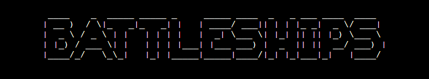
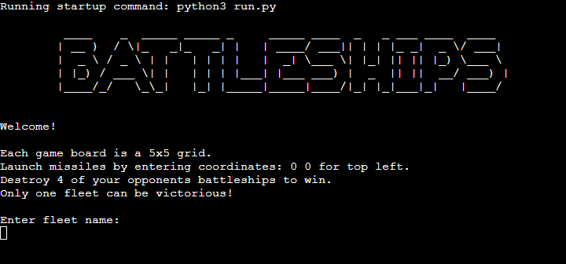
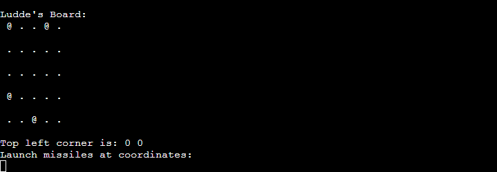
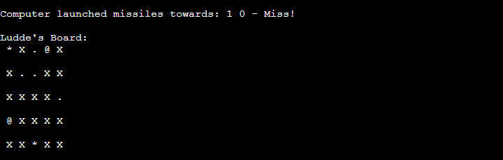
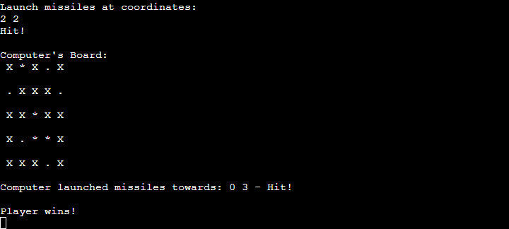

Welcome to Battleships! Prepare for an exciting guessing game where you challenge the computer. The game's origins are uncertain, but it has been played by generations with pen and paper, becoming a favorite pastime among soldiers and sailors. The commercial version of Battleship was introduced in 1967, quickly becoming a classic board game enjoyed by millions around the globe. Since then, Battleship has seen various adaptations, including electronic versions and online games, like the one you're about to play!

The live link can be found here - [Battleships](https://battleships-luddehs-2e4a9e42245c.herokuapp.com/)

Table of Contents

  * [How to Play](#how-to-play)  
  * [Features](#features)
    + [Introduction Section](#introduction-section)
    + [Game Launch](#game-launch)
    + [Guess Input Validation and Error Handling](#guess-input-validation-and-error-handling)
    + [Game Result and Guessing Feedback](#game-result-and-guessing-feedback)
    + [Future Features](#future-features)
  * [Data Model](#data-model)
  * [Testing](#testing)
    + [PEP8 Testing](#pep8-testing)
    + [Input Testing](#input-testing)
    + [Other Game Testing](#other-game-testing)
  * [Libraries and Technologies Used](#libraries-and-technologies-used)
    + [Python Libraries](#python-libraries)
    + [Programs Used](#programs-used)
  * [Fixed Bugs](#fixed-bugs)
    + [Known Bugs](#known-bugs)
  * [Deployment](#deployment)
  * [Credits](#credits)
  * [Acknowledgments](#acknowledgments)

## How to Play
At the outset, both the player and the computer receive a 5x5 grid, each with four randomly positioned ships. The ship locations are concealed from the opposing player; while the player can view their own ships, the computer's ships remain hidden. To make a guess, input coordinates, comprising one row integer and one column integer separated by a space. After guessing, you will either hit or miss; duplicates of the same coordinates are not allowed. The aim of the game is to sink all of the opponent's ships.
- Before starting the game, you need to choose a name consisting of at least three letters and press enter.
- Once your name is validated, your game board, consisting of five rows and five columns, will be displayed, with four ships randomly positioned on it.
- Your opponent, the computer, will also receive a game board with its ships hidden from you.
- Now, the game begins:
  - Make a guess by entering coordinates.
  - Input two integers ranging from 0 to 4, separated by a space. The top-left corner corresponds to row 0, column 0.
  - Press enter to submit your guess.
- Updated game boards will be printed and reveal the outcome of each guess:
  - If your guess hits a ship, a "*" will appear at the coordinates, accompanied by a "Hit!" message.
  - If your guess misses, an "X" will appear at the coordinates, along with a "Miss!" message.
- To win, either you or the computer must sink all of the opponent's ships.

## Features

### Introduction Section
- The user is greeted by the title "Battleships" and a welcome message.
- The "Battleships" title was created using Pyfiglet, which converts ASCII text into ASCII art fonts.
- Beneath the title, instructions on how to play are provided.
- Once the user is ready to play, they are prompted to enter their fleet name. 

- Strong data validation is applied to the username input. Users are required to input usernames consisting of a minimum of three characters. If the user enters invalid data, an error message prompt: "Fleet name must consist of at least three characters" and users will be prompted to re-enter their name.

### Game Launch
- After name validation, the player's board will be printed displaying the location of the randomized ships with "@" and "." for empty spaces. 
The printed name above the board indicates whether it's the player's or computer's board.
- A reminder "Top left corner is: 0 0" is displayed to inform the player about the coordinate distribution.
- Below, an input prompt appears with the text: "Launch missiles at coordinates:", where the player is asked to guess the coordinates to target the computer's ships.

### Guess Input Validation and Error Handling
- The user's guess undergoes the following input validation:
  - The guess must consist of two numbers separated by a space. Otherwise, a ValueError message is printed: "Invalid input! Enter two integers ranging from 0 to 4."
  - Each number in the guess must be an integer ranging from 0 to 4. If not, "Invalid coordinates! Enter valid coordinates." will be displayed.
  - During gameplay, the user cannot guess the same coordinates twice. In such cases, the message "Target has already been hit. Enter new coordinates." will be shown.

### Game Result and Guessing Feedback
- Upon entering valid coordinates, the result is instantly displayed. The player and computer boards are printed, and depending on the outcome, a corresponding message is displayed next to the guessed coordinates.
  - For a hit, "*" is printed.
  - For a miss, "X" is printed.
  - "Player wins" is printed if all of the computer's ships are sunk.
  - "Computer wins" is printed if all of the player's ships are sunk.

### Future Features
- Add a function to quit the game during game-play.
- Printing scores after every turn.
- Add a "Play Again" function following completion of the game.

## Data Model
The Board class applies the principles of Object-Oriented Programming throughout this project. It encapsulates the state and behavior of the game board, including its size, the number of ships, the player's name, and whether it belongs to the player or the computer. The class provides methods for printing the board's current state and allowing players to make guesses on the board. Additionally, it initializes the board with empty spaces and tracks guessed coordinates and ship positions. Overall, the Board class provides a structured way to manage and interact with the game board within the Battleship game implementation.

## Testing

### PEP8 Testing
The python files have all been passed through [CI Python Linter](https://pep8ci.herokuapp.com/#). All python files were checked without any reported errors.

### Input Testing
User inputs were tested thoroughly to guarantee accurate handling of all input data and to provide appropriate feedback to the user.

- Fleet name input: Users are restricted from entering an empty space and must input at least three characters. Should invalid data be entered, an error message will display, stating "Fleet name must consist of at least three characters," prompting users to re-enter their name. Robust data validation is implemented for the username input.
- Guess coordinates input: The following testing was conducted on the user guess input:
  - Ensured that the guess consists of two integers separated by a space.
  - Verified that each integer in the guess is within the range of 0 to 4.
  - Checked for duplicate guesses of the same coordinates.
  - Feedback messages received during testing of the above were checked to ensure appropriate information was provided to the user.

### Other Game Testing
The game underwent comprehensive testing to ensure the following features operated as intended:

- Coordinates corresponds to appropriate positions within the 5x5 grid.
- Guesses can only be made within the grid.
- Random placement of 4 ships on the board.
- Preventing the computer from guessing the same coordinates twice.
- "Hit" or "Miss" messages corresponded to the result on the board.
- Icons for hits, misses, and ships are correctly displayed.
- Game ends when all 4 ships are successfully hit on either board.

## Libraries and Technologies Used

### Python Libraries:
- [random](https://docs.python.org/3/library/random.html?highlight=random#module-random) - `random.randint` is utilized for selecting random coordinates to populate the game boards
- [pyfiglet](https://pypi.org/project/pyfiglet/0.7/) - Used for transforming ASCII text into ASCII art fonts.

### Programs Used
- [GitHub](https://github.com/) - Version control.
- [Heroku](https://dashboard.heroku.com/apps) - Live project deployment.
- [CI Python Linter](https://pep8ci.herokuapp.com/#) - Python code validation.
- [ChatGPT](https://chat.openai.com/) - README.md proof reading.

## Fixed Bugs

#### Populating the board with too many ships
Previously, the random placement of ships on each board resulted in an excess of ships compared to the specified num_ships variable, which was set to 4. This issue came from the while True loop, which generated random points until an unoccupied point was found. To deal with this problem, I removed the outer for loop and instead implemented a while loop, which populates the board until the assigned number of ships (board.num_ships) is achieved. This adjustment guarantees that the loop continues until the board contains the correct number of ships.

#### Missing "*" display of ship hits on player's board 
Previously, when the computer successfully hit a ship, the "*" character indicating the hit was not displayed on the player's board.
To address this issue, I had to modify the print_board method in the Board class. Now, regardless of the value of the show parameter, hits on opponent ships are always displayed with the "*" character on the boards.

#### Game loop prematurely terminates
Previously, the game loop prematurely terminated before all four ships had been hit by either the player or the computer. The termination condition solely relied on the number of hits rather than ensuring all ships had been sunk. This leads to incorrect game endings, potentially declaring a winner before all ships are actually destroyed. To fix this bug, I had to update the play_game function to check if all ships on the opposing board had been sunk rather than just counting the number of hits. This ensures that the game continues until all ships on either board are destroyed, resolving the premature termination issue.

#### Computer guessing the same coordinates multiple times
Previously, the computer was able to guess the same coordinates multiple times without selecting a new target that hadn't been previously picked. The adjustments made address this issue by ensuring that the computer doesn't repeat guesses of the same coordinates. To accomplish this, a while loop was introduced for random point selection. This loop generates random coordinates (x, y) and checks if those coordinates have already been guessed. If they have, the loop continues generating new random coordinates until it finds a pair that hasn't been guessed yet.

## Known Bugs
- In the current implementation, there's a bug in the input validation system. Users can input leading zeros before the desired x and y coordinates, such as "004 00001", which will still be accepted as valid integers.

## Deployment

The site was deployed via [Heroku](https://dashboard.heroku.com/apps), and the live link can be found here: [Battleships](https://battleships-luddehs-2e4a9e42245c.herokuapp.com/)

## Credits

### Resources Used
- [W3Schools](https://www.w3schools.com/)
- [Stack Overflow](https://stackoverflow.com/)
- [Python Tutor](https://pythontutor.com/)
- [Python Development Environment in VS Code](https://www.youtube.com/watch?v=-nh9rCzPJ20&ab_channel=CoreySchafer) - This tutorial video helped me set up a Python Development Environment in Visual Studio Code and provided valuable tips for using the IDE.
- [Virtual Environments on Windows](https://www.youtube.com/watch?v=APOPm01BVrk&ab_channel=CoreySchafer) - This tutorial taught me how to use Virtual Environments with the Built-In venv Module on Windows operating systems.
- [Virtual environments workflow](https://stackoverflow.com/questions/26399754/how-to-use-python-virtual-environment-in-another-computer) - This article was helpful in setting up a workflow for working with virtual environments on different computers.
- [ASCII Art](https://www.asciiart.eu/text-to-ascii-art) - I used this website for ASCII Art inspiration. 
- [GitHub Profile AliOKeeffe](https://github.com/AliOKeeffe) - The structure of this README came from my fellow student.
- I used the Battleships game structure provided in the Code Institute Python Portfolio Project Scope as the foundation for my project.
- I followed the steps in the Code Institute Python walkthrough project - Love Sandwiches when setting up my Google Sheets API.

## Acknowledgments
- Thanks to my mentor Antonio, for his invaluable guidance and advice throughout the project.

- Thanks to the Code Institute slack community for their quick responses and very valuable feedback!
